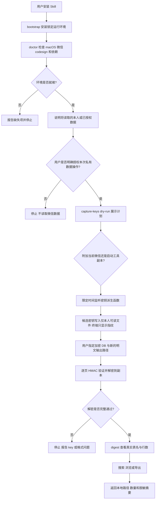

# 寂辉微信本地资料库

这是一个可直接安装的 macOS Codex Skill：在当前用户明确授权后，检查微信 4.x 本地环境、自动捕获数据库派生密钥候选、解密用户指定的数据库副本，再进行结构摘要、关键词搜索、联系人/朋友圈/收藏候选表浏览和 JSONL/CSV 导出。数据默认只留在本机。

> 仅用于处理你本人或你已经获得明确授权的微信数据。它不是远程入侵、账号接管、消息发送或云端采集工具。

## 这个 Skill 解决什么问题

微信本地资料处理不是“找到一个 db 文件就能搜索”。数据库可能被加密，微信更新可能改变派生过程和表结构，密钥本身又属于高敏感秘密。只给一段解密代码，外部用户既不知道从哪里开始，也无法判断结果是真的成功还是拿错了 key。

这个 Skill 把流程拆成多个有明确安全门的阶段：

- 先检查 macOS、WeChat、Python、Frida、加密库和 `codesign` 是否就绪。
- 每次接触私有数据前都要求当前任务的明确授权，命令还必须带 `--authorized`。
- 先 dry-run 展示捕获计划，再由用户选择附加到当前微信，或另行允许启动工具副本。
- 完整密钥只写入当前用户可读的本地文件，终端默认只显示 12 位指纹。
- 解密只读取用户指定的源数据库，并写入另一个权限为 `0600` 的输出文件。
- 每页 HMAC 验证通过才继续；拿错密钥或格式变化时明确失败，不伪造成功。
- 搜索和浏览默认脱敏；只有用户明确要求看正文时才使用 `--show-content`。

当前公开版处理的是用户明确指定的单个 SQLite 数据库快照。它不会假装已经自动识别所有微信私有表语义，也不会把“搜到候选表”说成完整的联系人关系或朋友圈产品语义。

## 整体运行流程



一句话理解：`输入 → 处理 → 输出`，也就是“本人/已授权的本机微信数据和明确的 DB 路径 → 授权检查、密钥候选捕获、HMAC 验证解密、只读检索 → 仅保存在本机的明文数据库副本、摘要或导出文件”。

## 开始前准备

必须满足：

1. macOS，当前公开版面向微信 Mac 4.x。
2. Python 3.10 或更高版本。
3. `/Applications/WeChat.app` 已安装。
4. 你正在处理自己的账号数据，或数据所有者已明确授权。
5. 能明确指出要处理的加密数据库文件和新的输出位置。

需要理解的两个模式：

- 默认 attach：附加到当前已经运行的 `WeChat` 进程，不复制或修改 App。
- `--launch-copy`：把原 App 复制到工具私有目录、对副本临时签名并启动。它不会修改 `/Applications/WeChat.app`，但这是额外动作，必须先单独说明并获得用户选择。

微信更新后内部函数或数据库格式可能变化。`doctor` 通过只代表环境齐全，不代表某个数据库必然能解密。

## 安装

全局安装 Skill：

```bash
npx skills add Amentman/amant-wechat-local-vault@amant-wechat-local-vault -g -y
```

只安装到当前项目：

```bash
npx skills add Amentman/amant-wechat-local-vault@amant-wechat-local-vault --agent codex --yes --copy
```

安装锁定的 Python 运行环境：

```bash
cd ~/.agents/skills/amant-wechat-local-vault
python3 scripts/bootstrap.py --install
.venv/bin/python scripts/wechat_vault.py doctor
```

`bootstrap.py` 安装并验证固定版本的 Frida、PyCryptodome 和 Zstandard；后续命令使用它返回的 `runtime_python`，不要绕回缺少依赖的系统 Python。

## 第一次使用

先只做环境检查，不读取私有数据库：

```text
使用 $amant-wechat-local-vault，只检查我的 Mac 是否具备运行条件。不要附加微信进程，不要读取数据库，不要抓密钥。
```

获得检查结果后，如果确实要处理自己的数据，再明确说：

```text
使用 $amant-wechat-local-vault 处理我本人当前 Mac 上的微信数据。我授权这一次先执行密钥捕获 dry-run，把计划和保存位置告诉我；暂时不要真实附加进程。
```

对应的安全命令是：

```bash
.venv/bin/python scripts/wechat_vault.py capture-keys --authorized --dry-run
```

真实捕获不会因安装 Skill 自动开始。用户确认 dry-run 计划和模式后，才运行：

```bash
.venv/bin/python scripts/wechat_vault.py capture-keys --authorized --duration 30
```

## 每一步会发生什么

| 步骤 | 用户提供或决定 | Skill 会做什么 | 可验证产物 |
|---|---|---|---|
| 1. 安装运行环境 | Python 3.10+ | 创建 Skill 内独立 `.venv` 并安装锁定依赖 | `runtime_python` 与依赖检查 |
| 2. 设备体检 | 无私有数据 | 检查 macOS、WeChat、codesign、Frida 和加密库 | `doctor` JSON |
| 3. 授权门 | 数据归属和本次允许的动作 | 没有明确授权就停止；私有命令要求 `--authorized` | 授权范围说明 |
| 4. 捕获预演 | attach 或工具副本；持续时间 | 输出将使用的 App、模式、保存位置和时长，不附加进程 | dry-run 计划 JSON |
| 5. 捕获候选 | 用户明确允许真实捕获 | 监听本机 PBKDF 派生结果，去重候选；终端只打印指纹 | 私有 `keys.json`、candidate count |
| 6. 选择数据库 | 加密 DB 绝对路径和新输出路径 | 只读源文件，使用候选 key 逐页验证并解密 | 权限为 `0600` 的明文副本 |
| 7. 查看结构 | 明文 DB 路径 | 只读打开 SQLite，列出真实表名和行数 | digest JSON |
| 8. 搜索或浏览 | 关键词、功能、条数 | 搜索文本列，或按公开功能提示找候选表 | 默认脱敏的匹配结果 |
| 9. 导出 | 查询、格式和输出路径 | 写出 JSONL 或 CSV，文件权限设为 `0600` | 本地导出文件和行数 |
| 10. 最终报告 | 无 | 汇报实际成功阶段、路径、数量和未解决结构差异 | 可复验的本地结果 |

## 输入与输出

关键输入：

- 授权范围：本人数据或已经获准的数据，以及本次允许执行的动作。
- 捕获模式：attach 或 `--launch-copy`，以及捕获时长。
- `source-db`：用户明确指定的加密数据库绝对路径。
- `output`：与源文件不同的明文数据库或导出文件路径。
- `key-hex`：本机私有 key store 中的 32 字节派生密钥候选。
- 搜索关键词、结果上限，以及是否明确允许显示正文。

默认本地资产目录：

```text
~/Library/Application Support/AmantWeChatVault/
├── private/keys.json        # 完整候选密钥，仅当前用户可读
├── apps/WeChatVault.app     # 仅在 --launch-copy 模式生成
└── vault/                   # 用户可选择用于数据库副本
```

`keys.json`、解密数据库和导出文件包含高敏感信息，文件权限为 `0600`。不要提交 Git、上传网盘、粘贴到聊天或在公开日志中打印完整内容。

## 完整示例

以下路径和 key 都是占位符，必须替换成本机本次授权的数据：

```bash
# 1. 安装并检查
python3 scripts/bootstrap.py --install
.venv/bin/python scripts/wechat_vault.py doctor

# 2. 先展示捕获计划
.venv/bin/python scripts/wechat_vault.py capture-keys --authorized --dry-run --duration 30

# 3. 用户确认后，附加当前微信并捕获候选；终端不显示完整 key
.venv/bin/python scripts/wechat_vault.py capture-keys --authorized --duration 30

# 4. 从本机私有 keys.json 选择候选，解密到另一个文件
.venv/bin/python scripts/wechat_vault.py decrypt --authorized \
  --source-db "/absolute/path/to/encrypted.db" \
  --output "/absolute/path/to/plain.db" \
  --key-hex "REPLACE_WITH_64_HEX_KEY"

# 5. 先看实际数据库结构
.venv/bin/python scripts/wechat_vault.py digest --db "/absolute/path/to/plain.db"

# 6. 默认脱敏搜索
.venv/bin/python scripts/wechat_vault.py search "产品反馈" \
  --db "/absolute/path/to/plain.db" --limit 20

# 7. 将明确查询导出到本地 owner-only 文件
.venv/bin/python scripts/wechat_vault.py export \
  --db "/absolute/path/to/plain.db" \
  --query "产品反馈" --format jsonl --output ./exports/result.jsonl
```

捕获阶段可能得到多个候选，也可能因为 30 秒内没有发生对应派生而得到 `candidate_count: 0`。候选是否属于目标数据库，以解密过程的逐页 HMAC 验证为准；不能凭候选出现就宣称成功。

`contacts`、`moments` 和 `favorites` 命令会根据表名公开提示寻找候选表：

```bash
.venv/bin/python scripts/wechat_vault.py contacts --db "/absolute/path/to/plain.db" --limit 20
.venv/bin/python scripts/wechat_vault.py moments --db "/absolute/path/to/plain.db" --limit 20
.venv/bin/python scripts/wechat_vault.py favorites --db "/absolute/path/to/plain.db" --limit 20
```

它们默认返回字段指纹，不把未知私有表结构冒充成已经正确解析的产品语义。

## 失败、停止与授权边界

- 不是 macOS、未安装微信、运行依赖缺失或 `doctor` 不通过：停止，先修环境。
- 用户没有明确说明数据归属和本次授权：不加 `--authorized`，不读取私有数据。
- dry-run 尚未让用户确认真实捕获模式：不附加进程、不复制 App。
- attach 找不到微信进程：报告失败；不能自行改为 `--launch-copy`。
- `candidate_count: 0`：只说明本次没有捕获到候选，不等于没有数据库或工具已完成。
- HMAC 任一页失败：停止，说明 key 或数据库格式不匹配，不把部分输出当作有效数据库。
- 数据库表结构与已知提示不同：先输出 digest，再做保守搜索，不编造联系人、朋友圈或收藏语义。
- 默认不显示正文；只有用户明确要求查看具体内容时才使用 `--show-content`。
- 工具不发送微信消息、不操作聊天界面、不上传远端、不修改原始 WeChat.app，也不采集他人设备。
- 完整密钥、明文数据库和导出结果不得写入公开仓库或普通日志。

## 如何确认真的完成

只有以下证据齐全，才能说对应阶段完成：

- 运行环境：bootstrap 返回 `ready`，doctor 的每项检查结果明确。
- 密钥捕获：用户确认了真实模式；输出有真实 `candidate_count` 和本机 key store 路径，完整秘密未出现在终端。
- 数据库解密：目标 key 对全部页面的 HMAC 检查通过；输出是另一个实际存在的 `0600` 文件；源数据库未被修改。
- 检索：先确认 SQLite 能以只读模式打开，digest 给出真实表数和行数；搜索报告真实匹配数。
- 导出：目标 JSONL/CSV 实际存在、权限为 `0600`，报告的行数与文件内容一致。
- 最终报告区分“环境就绪、捕获到候选、解密成功、搜索成功”四种状态，不用其中一步替代整条链路。

自动化测试只使用合成数据库和模拟捕获消息；CI 只运行 `capture-keys --authorized --dry-run`，不会接触真实微信数据。公开实现依据与许可证边界见[实现来源说明](skills/amant-wechat-local-vault/references/implementation-sources.md)。许可证：[MIT](LICENSE)。
